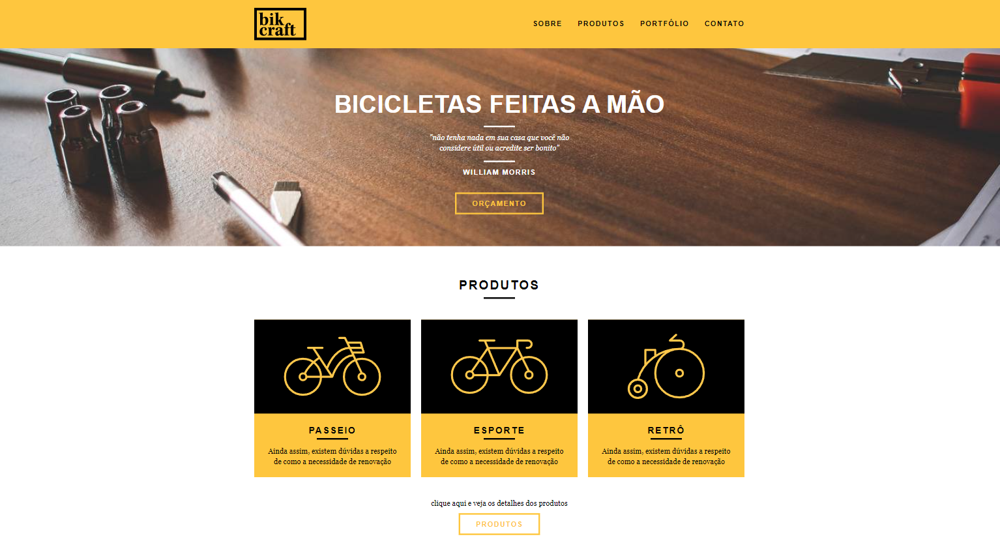

<div align="center">
  
</div>



# :bike: Sobre o Projeto
Projeto fictício realizado durante o curso de Web Design Completo da Origamid, consiste em um site de venda de bicicletas personalizadas.

#⚡ Tecnologias
Desenvolvido com as seguintes ferramentas:

* HTML5
* CSS3
* JavaScript

## :point_right: Como executar o projeto
```
- Clone o repositório:
$ git clone https://github.com/heyanaclara/bikcraft.git

- Entre no diretório:
$ cd bikcraft
```

[:mortar_board: Certificado do Curso](https://www.origamid.com/certificate/0a2c4db6/)

## :memo: Licença
Esse projeto está sob a licença MIT. Veja o arquivo [LICENSE](LICENSE.md) para mais detalhes.